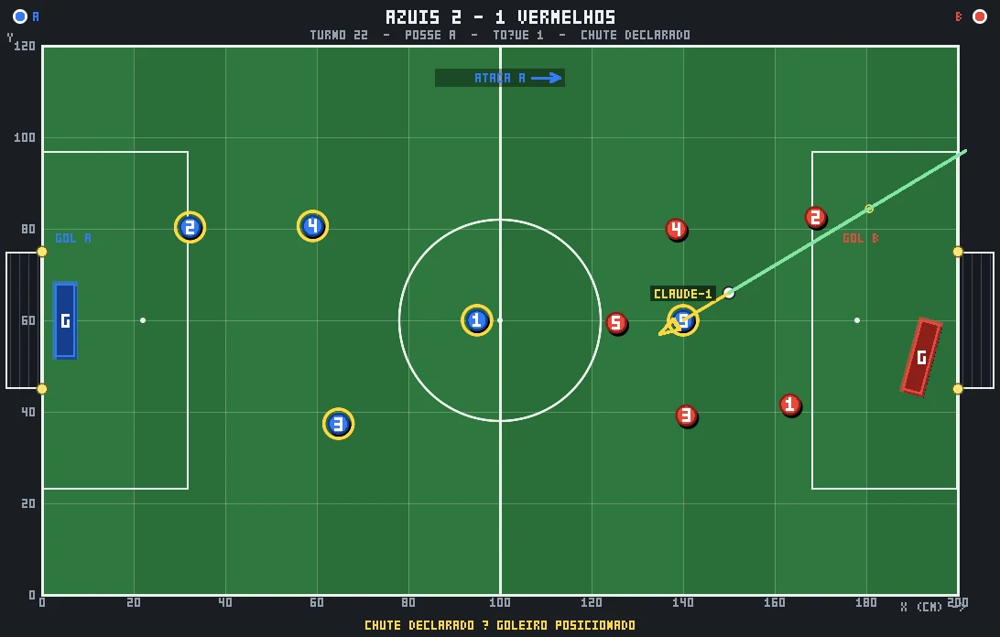

# ⚽ Futebotão

Futebol de botão jogado por turnos, com mesa 3D no navegador, API HTTP, broker de
eventos no estilo MQTT e bots de IA que entram na partida pela mesma API que um humano.

A jogada é feita como no jogo de verdade: você posiciona a **palheta** no aro do botão
(ângulo, inclinação, avanço) e aperta com uma força. Tudo por coordenadas — e a
configuração é transmitida ao vivo, então dá para **assistir a IA escolhendo o lance**
antes de ela bater.

O servidor é autoritativo: a física roda em 2D no servidor (é isso que o jogo é —
discos deslizando numa mesa plana) e o 3D do navegador é apresentação daquele resultado.

**Zero dependências de produção.** HTTP, WebSocket (RFC 6455 implementado à mão),
física, encoder PNG, som e broker são todos código do projeto, só com módulos do Node.
O `package.json` tem uma única entrada, em `optionalDependencies`: o SDK da Anthropic,
que só o `bot/ai-bot.js` usa. Sem ele o jogo inteiro funciona igual.

---

## Começando

```bash
node server/index.js          # http://localhost:3000
```

Abra `http://localhost:3000`, crie um jogador com nome e senha, crie uma partida e entre.

### Ver dois bots jogando na hora

```bash
node bot/demo-match.js --possessions 30
```

Ele imprime o link para acompanhar a partida em 3D no navegador.

### Jogar contra um bot

```bash
# num terminal
node bot/heuristic-bot.js --create --name sparring --password sparring1234
# ele imprime o id da partida; abra o link no navegador, entre no outro time e comece
```

### Bot jogado pelo Claude

```bash
npm install @anthropic-ai/sdk
export ANTHROPIC_API_KEY=...          # ou: ant auth login
node bot/ai-bot.js --create --name claude-1 --password segredo1234 --follow
```

---

## Como funciona

```
                       ┌──────────────────────────────┐
   navegador  ────────▶│  REST  /api/...              │
   (mesa 3D)  ◀────────│                              │
                       │  servidor autoritativo       │
   bot de IA  ────────▶│   · física 2D determinística │
   (node)     ◀────────│   · turnos e regras          │
                       │   · render do frame PNG      │
                       │                              │
                       │  broker WS  (tópicos MQTT)   │
                       └──────────────────────────────┘
```

A cada jogada o servidor simula até tudo parar e devolve a **trajetória completa**
(keyframes a 60 fps), que o navegador reproduz. Bots recebem só o resultado.

### Economia de token nos bots

Esse foi um requisito de projeto, e aparece na forma de três níveis de consumo:

| O que o bot faz | Custo |
|---|---|
| Assina `player/{id}/turn` e fica quieto | ~520 bytes por turno **seu**, nada nos outros |
| `--follow`: assina também os eventos da partida | mais uns 200 bytes por gol/falta, **sem chamar o modelo** |
| `--think-ahead`: pensa entre os turnos | uma chamada curta ao modelo por turno do adversário |

Quando chega a vez, o bot decide o quanto puxar:

```js
await cli.state(gameId, { brief: true });                    // ~270 bytes
await cli.state(gameId, { describe: true });                 // texto pronto para LLM
await cli.state(gameId, { describe: true, frame: true });    // + imagem PNG da mesa
```

O prompt de sistema do bot é estático e vai com `cache_control`, então o cache
cobre a maior parte da entrada a partir do segundo turno.

---

## O frame

O servidor desenha a mesa vista de cima e devolve um PNG. É o que a IA enxerga.



Tem grade de coordenadas, rótulo em cada disco, indicação de quem ataca para que
lado e de quem é cada gol — tudo para o modelo conseguir ligar o que vê aos
números que recebe em texto.

```
GET /api/games/{id}/frame.png?token=...      → image/png
GET /api/games/{id}/state?frame=1            → { frame: { data: "<base64>" } }
```

---

## Estrutura

```
server/
  index.js      HTTP, rotas REST, estáticos, upgrade do WebSocket
  palheta.js    modelo da palheta: rendimento, desvio, cavadinha e previsão
  game.js       estado da partida, formações, turnos, regras
  physics.js    física 2D determinística (atrito de Coulomb + impulsos)
  ws.js         servidor WebSocket RFC 6455 escrito à mão
  broker.js     tópicos, curingas, retain, controle de acesso
  render.js     desenho da mesa vista de cima
  png.js        encoder PNG + superfície de desenho + fonte bitmap
  describe.js   estado em texto compacto para LLM
  store.js      jogadores em disco, partidas em memória (contas de bot não vão para o disco)
  bot-local.js  adversário de IA que roda dentro do servidor (botão "Jogar contra a IA")
  auth em util.js (scrypt)
public/
  js/app.js       a cola: estado, painéis, replay, atalhos
  js/scene3d.js   a mesa em three.js (via importmap)
  js/estadio.js   arquibancada, torcida, refletores, telão
  js/torcida-som.js  som do estádio gerado em WebAudio
  js/teclado.js   atalhos da palheta (lógica pura, testável sem DOM)
  js/net.js       REST + broker
  css/style.css   a interface inteira
  img/            o pôster de abertura e o escudo, em webp (a única arte de arquivo)
  audio/          a trilha de fundo, feita para o jogo
bot/
  client.js       biblioteca de cliente para bots
  heuristic-bot.js bot geométrico, sem LLM
  ai-bot.js        bot jogado pelo Claude
  demo-match.js    bot contra bot, partida completa
tests/          física, calibração e testes ponta a ponta
scripts/
  testar.mjs    sobe um servidor só para os testes e roda a suíte
  duelo.mjs     mede a força da heurística: N partidas, e POR QUE a posse passou
  foto.py       fotografa a mesa num navegador headless (para julgar o visual)
  ouvir.py      renderiza e MEDE os sons (para julgar o som sem ouvir)
docs/           API.md e RULES.md
```

---

## As regras em um minuto

**Você joga até errar.** Não há limite de toques: enquanto a jogada for limpa, continua com você.
A vez só passa em quatro casos — falta (encostou num adversário antes da bola), não encostar na
bola, a bola sair de campo, ou a bola parar tendo tocado por último num botão adversário.

**O campo tem linhas abertas.** A bola sai de verdade: lateral, escanteio, tiro de meta. Aí abre a
**cobrança**: quem recebe escolhe um botão e o posiciona onde quiser perto da bola, e só então joga.

**O goleiro é uma caixa de fósforo** de 16 × 4,5 cm, fixa. Ela tem que caber onde for posta:
não entra em cima da bola, de um botão nem da trave. Antes disso a caixa entrava e o motor
empurrava quem estivesse embaixo — quem defendia reposicionava as peças do atacante só
arrastando o goleiro por cima delas. Quem a posiciona é o adversário — e só
quando você **declara** que vai chutar a gol. Gol sem declarar é anulado; é isso que faz declarar
ser uma decisão de verdade, e não só desvantagem. Declarar não custa a sua mira: a palheta volta
exatamente como estava quando o adversário termina de pôr a caixa. E **em bola parada não se
declara** — dê o primeiro toque e declare na jogada seguinte.

**Cada declaração vale por um chute.** Declarou, bateu e não fez gol? Para tentar de novo,
declare de novo — e o adversário decide de novo o que fazer com a caixa (inclusive deixá-la
exatamente onde está).

**A saída de bola é montada pelos dois.** Antes do primeiro toque (e depois de cada gol), cada time
arruma os próprios botões dentro do seu campo, ao mesmo tempo. Só quem vai bater pode adiantar até
2 botões para dentro do círculo central. É opcional: quem não quiser mexer é só bater.

**A bola sobe.** A borda arredondada do botão pega por baixo dela: palheta em pé levanta a bola e
dá para fazer gol por cima da caixa (5 cm) — mas o travessão está a 9 cm.

Detalhes e números em [docs/RULES.md](docs/RULES.md).

## Assistir sem jogar

No formulário de nova partida, **Você entra como** tem três opções: jogador do time A,
do time B, ou **só assistir**. Escolhendo assistir, você cria a mesa e fica de fora dela —
daí é um clique em **Preencher a mesa com IA e assistir** e a partida acontece sozinha na
sua frente, com a palheta de cada bot aparecendo antes de cada tacada.

Também dá para assistir a qualquer partida alheia pelo botão **Assistir** no lobby.

## Três jeitos de arrumar adversário

Com a mesa incompleta, o painel oferece dois botões:

- **Jogar contra a IA fixa** — o adversário heurístico embutido entra na hora e a
  partida começa. Geometria e física, sem LLM nenhuma.
- **Esperar uma IA (LLM / subagente)** — guarda a vaga e devolve um convite, com o
  comando pronto e um texto para colar direto num agente. Enquanto a IA não chega,
  a vaga fica reservada: quem tem o convite entra, mais ninguém. Há um botão por time,
  então dá para pôr uma LLM no azul, outra no vermelho, e ver as duas se enfrentarem.

O terceiro jeito é a próxima seção: outra pessoa.

```bash
# o que o convite devolve, pronto para rodar
node bot/ai-bot.js --game=gm_xxx --team=B --convite=cvt_xxx --base=http://localhost:3000
```

## Acabar a partida

**Encerrar a partida** termina o jogo na hora, com o placar como está. Quem pode: quem
está jogando, ou quem criou a mesa. Depois disso qualquer comando é recusado com uma
mensagem que diz o que houve — `a partida acabou (encerrada por joao) — placar final
2 x 1` — em vez de um erro genérico, e os bots embutidos param sozinhos.

## Jogar contra outro humano

Já funciona, sem configurar nada: o servidor escuta em `0.0.0.0`. A outra pessoa abre
`http://<seu-ip-na-rede>:3000`, cria o jogador dela e entra no outro time. Os dois veem a mesa ao
vivo, inclusive a palheta do adversário sendo ajustada antes de cada jogada.

Na mesma máquina, use outro navegador ou uma janela anônima (a sessão vive no `localStorage`).
Pela internet, seria preciso um túnel — isso não vem embutido.

## Palheta

```
       palheta
                               anguloAro   onde ela encosta no aro (o botão sai a +180°)
          ___                  inclinacao  ângulo com a mesa — rasteiro ou pelo alto
         /                     avanco      da borda (0) ao centro (1) — 0.35 rende mais
        /        <- bisel      forca       0.05 a 1.0
       |________|
    ================ mesa
```

A **inclinação** é o controle que decide o jogo. A curva é assimétrica de propósito:
deitada demais a palheta escorrega e a força se perde; em pé ela não perde, redireciona
para cima.

| inclinacao | rendimento | a bola sobe |
|---|---|---|
| 12° | 2% — escorrega | 0 |
| **45°** | **100% — rasteiro e forte** | **0** |
| 55° | 93% | ~3 cm |
| 65° | 74% | ~7 cm (passa por cima da caixa) |
| 80° | 40% | ~7 cm |

Acima de 66° com força o botão ainda dá **cavadinha**: pula por cima dos adversários.
Detalhes em [docs/RULES.md](docs/RULES.md#a-palheta).

Enquanto o jogador ajusta, cada mudança vai para `game/{id}/aim` com o nome de quem
está segurando e a previsão do lance. O navegador desenha a palheta como um disco
translúcido apoiado no aro do botão, com a etiqueta do jogador em cima.

### Teclado

Com o foco fora dos campos. **Ctrl não é usado** — Ctrl+W fecha a aba do navegador,
e isso não dá para impedir:

| tecla | o que faz |
|---|---|
| `1` … `9`, `0` | escolhe o botão (0 é o décimo) |
| ← → ou `A` `D` | **viram a mira** para aquele lado |
| ↑ ↓ ou `W` `S` | inclinação |
| `Shift` + as mesmas | avanço e força |
| `Q` `E` e `F` `R` | avanço e força, sem modificador |
| segurar a tecla | o passo acelera (até ×5) |
| espaço | aperta a palheta |

A seta aponta para onde o BOTÃO vai, não para onde a palheta se apoia. São coisas
opostas — o apoio fica atrás (`direção = anguloAro + 180`) —, e quem joga pensa no alvo.

No posicionamento dá para **arrastar com o mouse**, ou digitar as coordenadas: vale para os
botões na saída de bola e nas cobranças, e para a caixa do goleiro. A região válida fica
desenhada no feltro.

## Estádio

A mesa está no meio de um estádio, e isso é de propósito: futebol de botão de verdade é uma
mesa numa sala, e aqui não precisa ser. Arquibancada em anel, milhares de pessoas que pulam,
ola depois do gol, refletores nos cantos, telão com o placar e faixas de publicidade na beira
do gramado. A torcida veste a cor do time atrás de cada gol.

Nada disso toca no jogo — é cenário, e mora em `public/js/estadio.js`. A animação da torcida
roda no shader (uma fase por pessoa), então o custo por quadro na CPU é um uniforme de tempo.

Atrás de cada gol há um **bandeirão** com o escudo do jogo. Ele não fica sempre aberto: sobe
no gol do lado dele e, fora isso, de vez em quando. Bandeirão permanente vira papel de parede
em trinta segundos; um que aparece é evento. O desenrolar é feito no shader, descartando o que
ainda está enrolado, então custa um uniforme por quadro.

### Som

Tudo **sintetizado com WebAudio**, sem nenhum arquivo de áudio: ruído rosa filtrado vira
murmúrio de torcida, o mesmo ruído com o filtro aberto vira o rugido do gol, e apito, tambor,
estalo da palheta e as pancadas de colisão saem de osciladores. Botão **🔇 Torcida**; só
começa depois de um clique, porque é regra do navegador.

As colisões são tocadas no instante `t` de cada evento da trajetória — são umas 337 pancadas
por partida, com timbre por par de peças e intensidade pela velocidade do contato. Há um teto
de disparos: uma carambola de sete contatos em 30 ms somaria as vozes e estouraria em
distorção.

Para julgar som sem ouvido (revisão por texto, agente, CI), `scripts/ouvir.py` renderiza o
mesmo código num `OfflineAudioContext` e imprime pico, RMS, duração, ataque e o envelope
desenhado — e grava um `.wav` para quem quiser ouvir de verdade.

### Música de fundo

A trilha (`public/audio/maracana.mp3`) foi feita para o jogo e vem junto no repositório —
é o único arquivo pesado dele. O botão **Música** a toca em laço, com régua de volume ao lado.
Ela não passa pelo volume da torcida: são dois controles, porque quem baixa a música
costuma querer continuar ouvindo o apito. No gol ela abaixa sozinha por seis segundos e
volta — música alta por cima do rugido vira barulho. Para trocar a faixa, é só substituir o
arquivo; outros formatos servem (ver `public/audio/LEIA-ME.txt`).

## Replay

Terminada (ou no meio da) partida, **Ver replay** abre a linha do tempo de todos os
lances. Cada lance é uma fita única:

```
[ajuste 1] [ajuste 2] ... [ajuste n] [APERTOU] [quadro 1] [quadro 2] ...
 ____________ a palheta sendo configurada ___________/   __ o lance __/
```

Andando passo a passo você vê a palheta mudando de ângulo, inclinação, avanço e força
até a configuração que foi jogada — com o rendimento de cada passo. Depois vem a
batida, e só então a bola rola. Play, salto por lance, 0,25x a 4x, lista clicável.
Teclado: espaço toca, setas andam.

```
GET /api/games/{id}/replay          índice leve (poucos KB)
GET /api/games/{id}/replay?full=1   com todas as trajetórias
GET /api/games/{id}/replay/{n}      um lance
```

## Antes de abrir para outras pessoas

O servidor escuta em `0.0.0.0` por padrão — a rede local inteira alcança o jogo. Enquanto
for uma mesa entre amigos, tudo bem. Se for além disso, duas coisas precisam mudar:

```bash
export BOT_PASSWORD='algo bem seu'   # os bots de exemplo têm senha no código-fonte
HOST=127.0.0.1 node server/index.js  # ou prenda o servidor nesta máquina
```

Você não precisa lembrar disso: **o jogo avisa**. Enquanto houver algo a apontar, aparece
uma faixa no topo da página, o servidor imprime o aviso ao subir, e o bot avisa em letras
garrafais quando entra com a senha padrão. Resolvido, os avisos somem sozinhos —
`GET /api/seguranca` é quem responde por eles.

O que este projeto **não** tem: limite de taxa no registro, HTTPS, e `/api/players` lista
todo mundo. Não exponha na internet sem pôr algo na frente.

## Testes

```bash
npm test                       # a suíte inteira
node scripts/testar.mjs regras # só os arquivos que casam com "regras"
```

O runner sobe um servidor **só para os testes**, numa porta própria (3199) e com um
`DATA_DIR` descartável, e o derruba no fim. Isso não é cosmético: antes os testes de API
rodavam contra o seu servidor, e cada rodada deixava dezenas de jogadores de teste em
`data/players.json` e enchia o seu lobby de partidas chamadas "Convite a1b2". Agora os
seus dados e a sua mesa não são tocados.

O que cada arquivo cobre:

| arquivo | o que garante |
|---|---|
| `physics` | Coulomb, traves, determinismo — confere a distância de parada contra `d = v²/(2·μ·g)` |
| `caixa` | goleiro-caixa (retângulo girado) e linhas abertas |
| `bolaalta` | a bola sobe: gol por cima da caixa, travessão, quique |
| `palheta` | rendimento, desvio, cavadinha, e o inverso (força para uma distância) |
| `previsao` | a previsão do lance na mira bate com o lance de verdade |
| `atalhos` | teclado da palheta (setas, WASD, números) — lógica pura, sem DOM |
| `regras` | posse, declaração, goleiro, cobrança, gol contra, formação da saída, lateral |
| `rotacao` | rotação da vez em times com vários jogadores |
| `render` | o PNG da mesa sai desenhado |
| `e2e` | auth, broker, regras, turnos, frame |
| `palheta-e2e` | palheta pela API, mira ao vivo e replay |
| `goleiro-e2e` | declaração e posicionamento do goleiro pela API |
| `saida-e2e` | formação da saída: campo de cada um, círculo central |
| `convite-e2e` | guardar a vaga para uma IA de fora e o convite |
| `ajustes` | mira ao vivo e histórico de ajustes |
| `lobby` | vagas por time, entrar e sair |
| `ia-local` | adversário embutido, nomes únicos, criar sem entrar e assistir |
| `resiliencia` | cliente mal comportado não pode derrubar o servidor |
| `ai-bot` | encanamento do bot de IA (SDK falso, sem gastar API) |

`node tests/calibration.mjs` imprime a tabela de força × distância percorrida.

---
## Documentação

- [docs/API.md](docs/API.md) — todas as rotas REST e o protocolo do broker
- [docs/RULES.md](docs/RULES.md) — regras, geometria da mesa e números da física

## Configuração

| Variável | Padrão | O que é |
|---|---|---|
| `PORT` | `3000` | porta HTTP |
| `HOST` | `0.0.0.0` | interface |
| `DATA_DIR` | `./data` | onde ficam os jogadores |
| `ANTHROPIC_API_KEY` | — | só para o `bot/ai-bot.js` |

Senhas são guardadas com scrypt e sal por usuário. Os tokens de sessão vivem em
memória e valem 7 dias.
